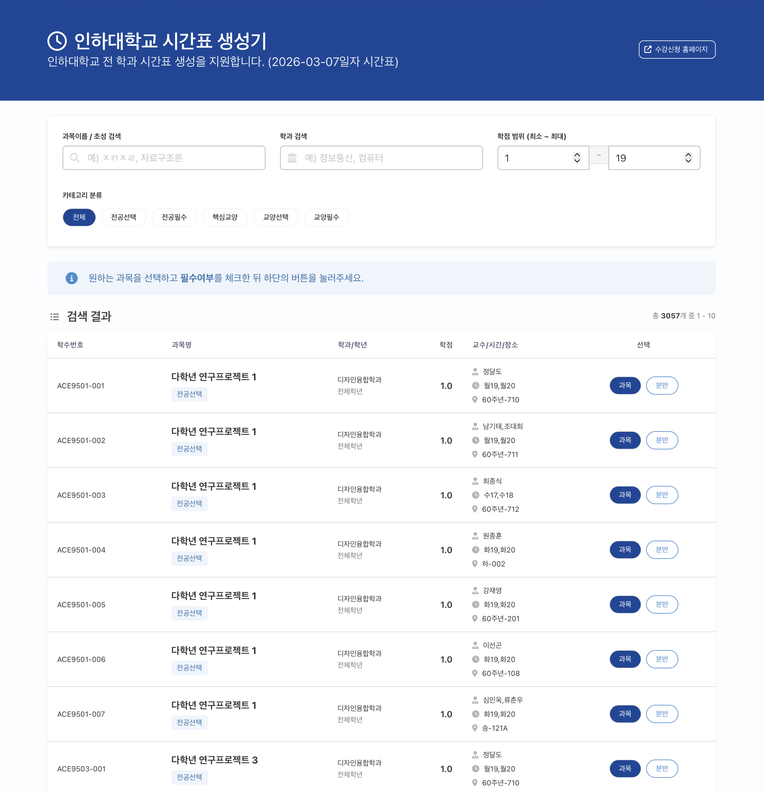
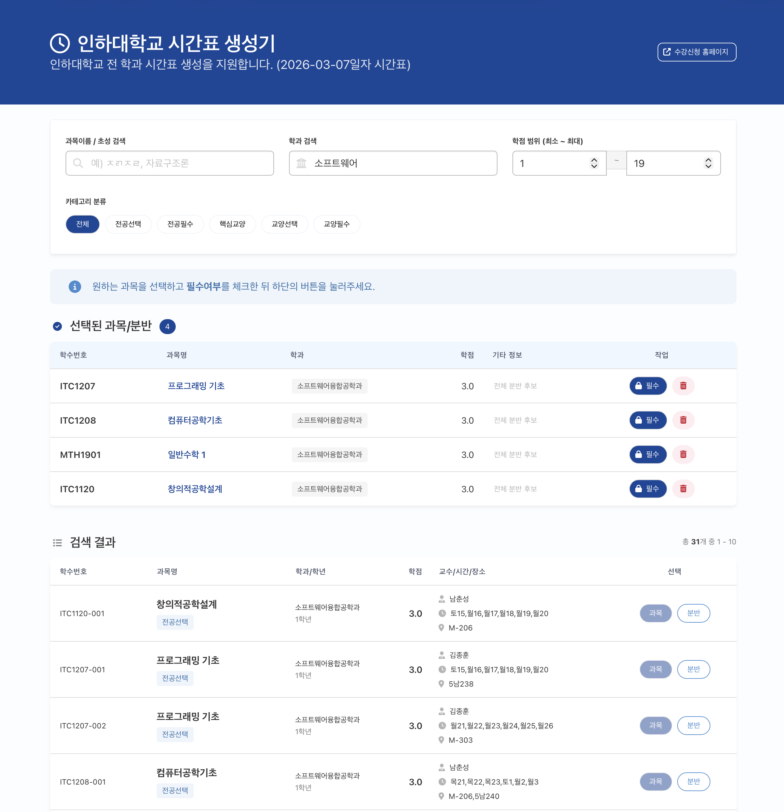
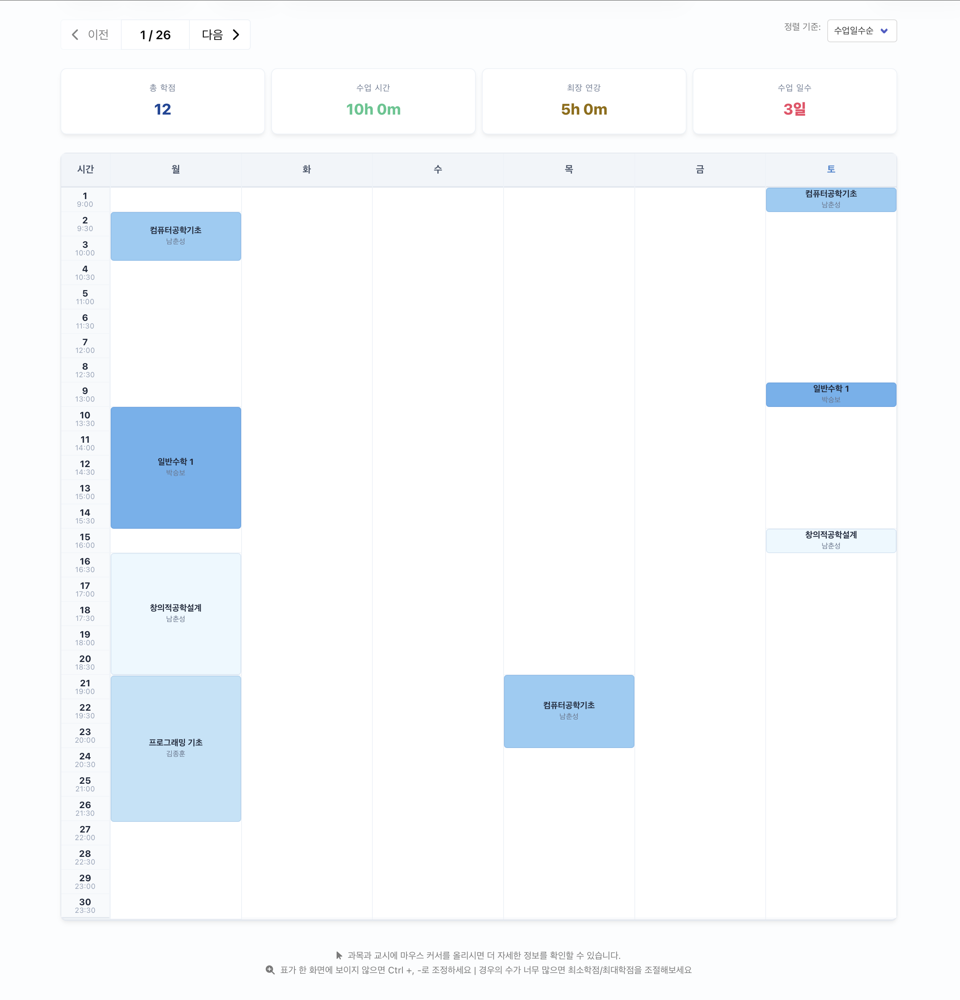

# ⏰ 인하대학교 수강신청 시간표 생성기 (Nuxt 4)

[](https://nuxt.com/)
[](https://github.com/inha-fc/inha-sugang-timetable-generator/actions/workflows/deploy.yml)

인하대학교 학생들을 위한 스마트한 시간표 생성 도구입니다. 원하는 과목들을 골라 넣기만 하면, 공강 시간과 학점 제한을 고려하여 가능한 모든 시간표 조합을 자동으로 계산해 드립니다.

## 📸 실행화면
| 메인 화면 및 필터 | 과목 선택 및 검색 | 생성된 시간표 뷰 |
| :---: | :---: | :---: |
|  |  |  |

## ✨ 주요 특징
- **자동 조합 생성**: 선택한 과목들로 구성 가능한 모든 시간표를 수 초 내에 생성합니다.
- **다양한 필터링**: 최소/최대 학점 설정, 필수 과목 지정 기능을 제공합니다.
- **실시간 검색**: 초성 검색을 지원하여 빠르게 과목을 찾을 수 있습니다.
- **전 학과 지원**: 인하대학교 내 개설된 모든 학과(부)의 전공 및 교양 과목을 지원합니다.
- **확장된 시간표**: 토요일 수업 및 야간 수업(최대 30교시)까지 완벽하게 표시합니다.
- **Nuxt 4 최적화**: 최신 **Nuxt 4** 환경을 기반으로 크롬, 사파리 등 최신 브라우저에서 완벽하게 작동합니다.
- **인하블루 테마 UI**: 인하대학교 컬러를 적용한 깔끔하고 모던한 인터페이스를 제공합니다.

## 🛠 마이그레이션 내역 (Legacy to Nuxt 4)
본 프로젝트는 기존 [agrajak/my-inha-sugang](https://github.com/agrajak/my-inha-sugang) 저장소를 기반으로 최신 웹 환경에 맞춰 대대적인 마이그레이션을 진행했습니다.

- **프레임워크 업그레이드**: Nuxt 2 (Vue 2)에서 **Nuxt 4** 환경으로 전환하여 성능을 개선했습니다.
- **디렉토리 구조 표준화**: Nuxt 4의 `app/` 디렉토리 기반 표준 구조를 도입하여 코드 체계를 정립했습니다.
- **브라우저 호환성 강화**: 사파리(Safari) 특유의 엔진 오류 및 MIME 타입 이슈를 해결했습니다.
- **독자적 크롤러 구현**: 외부 라이브러리 의존성을 제거하고, 모든 학과를 자동으로 스캔하는 고도화된 수집 로직을 구현했습니다.
- **알고리즘 최적화**: Map 자료구조 도입 및 중복 제거를 통해 대량의 시간표 조합 계산 속도를 향상시켰습니다.
- **자동 배포 파이프라인**: GitHub Actions를 통해 최신 강의 데이터 업데이트와 사이트 배포를 자동화했습니다.

## 🚀 로컬 실행 방법

### 설치
```bash
npm install
```

### 데이터 수집 (크롤링)
```bash
npm run fetch
```

### 개발 서버 실행
```bash
npm run dev
```
접속 주소: `http://localhost:3000/inha-sugang-timetable-generator/`

## 📦 배포
이 프로젝트는 GitHub Actions를 통해 **GitHub Pages**에 자동으로 배포됩니다. `main` 브랜치에 푸시하면 자동으로 빌드가 진행됩니다.

## ⚠️ 아카이브 알림
이 프로젝트는 현재 **더 이상 유지보수되지 않는 아카이브용 프로젝트**입니다. 2026년 3월 기준으로 최신 환경에서 동작하도록 마이그레이션이 완료되었습니다.

## 🤝 Contributors
- **Original Author**: [Suhyun Jeon](https://github.com/agrajak)
- **Refactoring & Optimization**: [Lee Jongyoung](https://github.com/leejongyoung)

## 📄 라이선스
ISC License. 자세한 내용은 [LICENSE](./LICENSE) 파일을 참고하세요.
